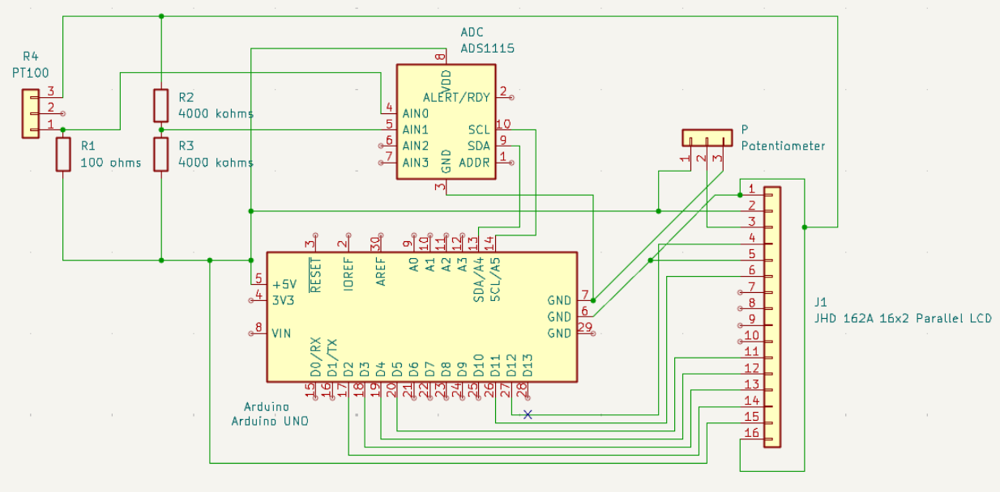
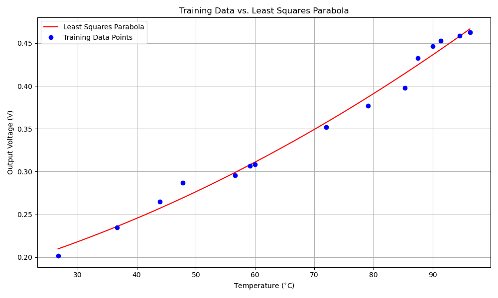
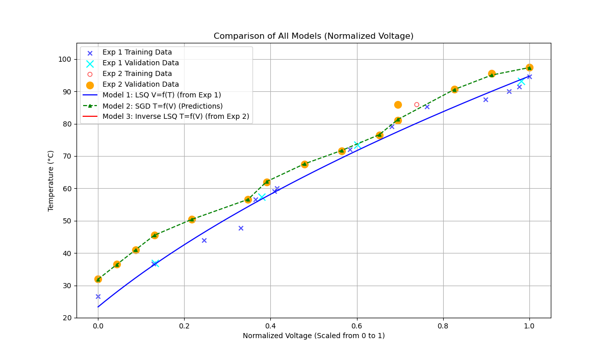

# PT100 Temperature Sensor with Arduino: A Comparative Model Analysis

The idea of this project is to build an accurate digital thermometer using a PT100 RTD (Resistance Temperature Detector). This repository explores two different hardware and software approaches to this problem.

## Hardware
* PT-100 RTD Sensor
* Arduino Uno
* ADS1115 16-bit ADC (for Exp. 1)
* 100 ohms Precision Resistor
* Two 4 kilo ohms Resistors (for Exp. 1)
* JHD 162A (16x2) Parallel LCD
* 22k ohm Potentiometer
* Breadboard & Jumper Wires

## Experiment 1: Wheatstone Bridge + ADS1115
This experiment aims for maximum hardware precision.

* **Circuit:** A Wheatstone bridge (100$\Omega$ resistor and PT100 balanced by two 4k$\Omega$ resistors) is used.
* **ADC:** The high-precision ADS1115 16-bit ADC measures the differential voltage from the bridge.
* **Model:** A quadratic Least Squares model of the form `V = aT^2 + bT + c` is trained (`lsq.py`).
* **Data:** This uses the low-voltage (`~0.2-0.4V`) dataset (`data_exp1/`).

## Experiment 2: Internal ADC + Direct Models
This experiment tests simpler hardware and direct `T = f(V)` models.

* **Circuit:** A simpler circuit (e.g., voltage divider) connected to the Arduino's analog input.
* **ADC:** The Arduino's built-in 10-bit ADC (`analogRead()`) is used.
* **Models:**
    1.  **SGD:** A machine learning pipeline using `PolynomialFeatures`, `StandardScaler`, and `SGDRegressor` (`model_trainer.py`).
    2.  **Inverse LSQ:** A simple quadratic model (`T = aV^2 + bV + c`) is trained for direct comparison.
* **Data:** This uses the high-voltage (`~2.6-2.9V`) dataset (`data_exp2/`).

## Combined Model Comparison
To visualize all three models, the data from Experiment 1 is artificially scaled to match the voltage range of Experiment 2. The plot shows the data and all three model predictions.

## Conclusion
Comparing the models, the **Inverse LSQ model (`T = f(V)`)** from Experiment 2 is the best compromise. It provides accuracy nearly identical to the complex SGD pipeline but is far simpler to train and implement on the microcontroller.

However, the **hardware from Experiment 1** (Wheatstone bridge + ADS1115) is the most robust and precise. The optimal system would combine the superior hardware from Exp. 1 with the simple and direct Inverse LSQ modeling approach from Exp. 2.
